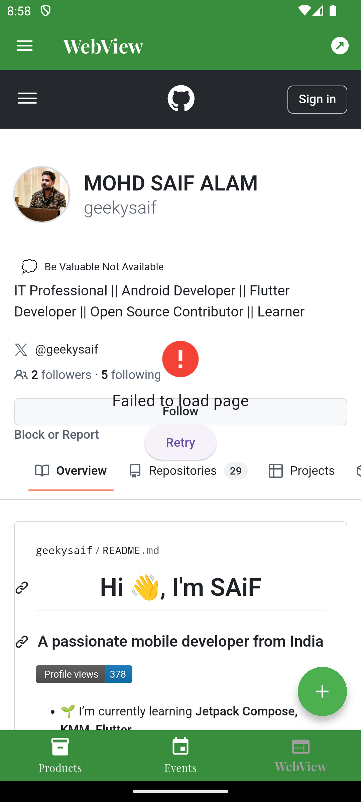
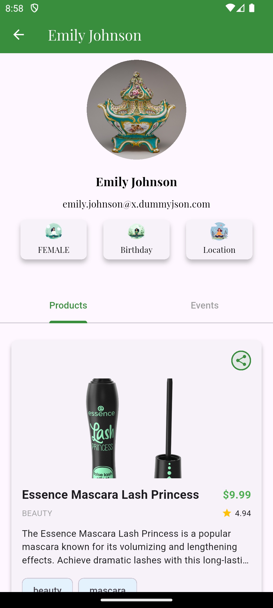

# Flutter Base Project 🚀

This is a Flutter base project that includes essential features such as state management with BLoC, local JSON handling, REST API integration, and various utilities for a complete cross-platform (Android, iOS, Web) experience.

## Features 🌟
- **📌 State Management**: BLoC pattern for efficient state handling.
- **📂 Local JSON Handling**: Load and parse local JSON files.
- **🌍 REST API Integration**: Uses `http` for network requests.
- **⚡ Chopper**: Efficient API client for RESTful communication.
- **🔔 Toast Notifications**: Display user-friendly messages.
- **📶 Internet Connection Detection**: Check and handle connectivity issues.
- **📅 Calendar Support**: Date and time picker for event handling.
- **📷 Image Picker & Camera**: Capture images from the camera or select from the gallery.
- **🌐 WebView In-App Browsing**: Open web pages within the app.
- **📤 Share Options**: Share content via native share dialogs.
- **✨ Shimmer Effect**: Loading skeletons for a better UX.
- **📱 Cross-Platform Support**: Works on Android, iOS, and Web.

## Installation ⚙️
1. Clone the repository:
   ```sh
   git clone <repository_url>
   cd <project_directory>
   ```
2. Install dependencies:
   ```sh
   flutter pub get
   ```
3. Run the app:
   ```sh
   flutter run
   ```

## Dependencies 📦
Ensure you have the following dependencies added in your `pubspec.yaml`:
```yaml
dependencies:
  flutter:
    sdk: flutter
  flutter_bloc: ^8.0.0
  http: ^0.13.0
  chopper: ^4.0.0
  connectivity_plus: ^3.0.2
  fluttertoast: ^8.0.8
  image_picker: ^1.0.0
  webview_flutter: ^4.2.2
  share_plus: ^7.0.0
  shimmer: ^3.0.0
  table_calendar: ^3.0.0
```

## Project Structure 🏗️
```
lib/
|-- blocs/           # BLoC state management
|-- models/          # Data models
|-- repositories/    # API handling and data sources
|-- screens/         # UI screens
|-- widgets/         # Reusable widgets
|-- main.dart        # Entry point of the app
```

## Usage 🛠️
- Implement new features by following the BLoC pattern.
- Update API calls inside the repository layer.
- Modify UI components within the `screens/` and `widgets/` directories.

## Contribution 🤝
Feel free to fork and contribute to the project.

## Contributors ✨
- Mohd Saif Alam (@geekysaif)

## Screenshots 📸

### API DATA, LOCAL JSON FILE DATA, WEBVIEW, and PROFILE Screens

<table>
  <tr>
    <td></td>
    <td></td>
    <td></td>
    <td></td>
  </tr>
  <tr>
    <td align="center"><b>API DATA Screen</b></td>
    <td align="center"><b>LOCAL JSON FILE DATA Page</b></td>
    <td align="center"><b>WEBVIEW Page</b></td>
    <td align="center"><b>PROFILE Page</b></td>
  </tr>
</table>

 

